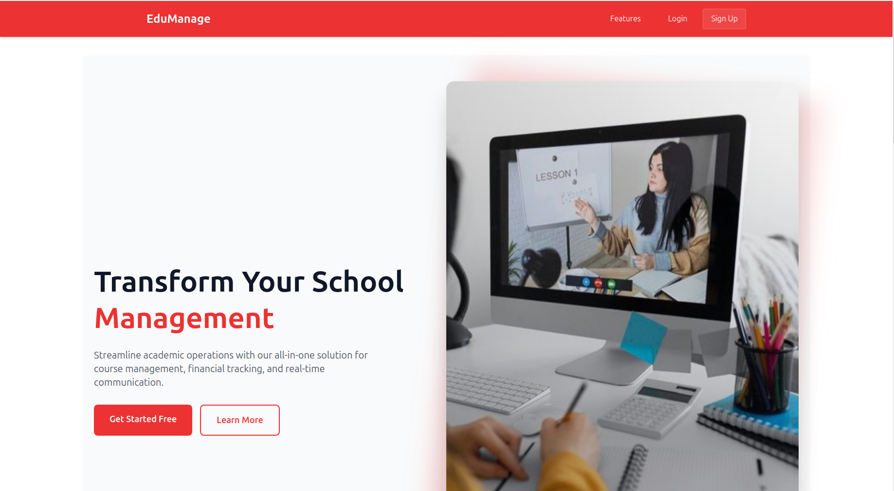
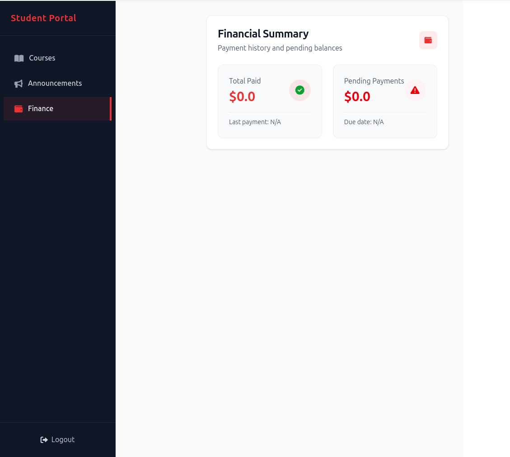
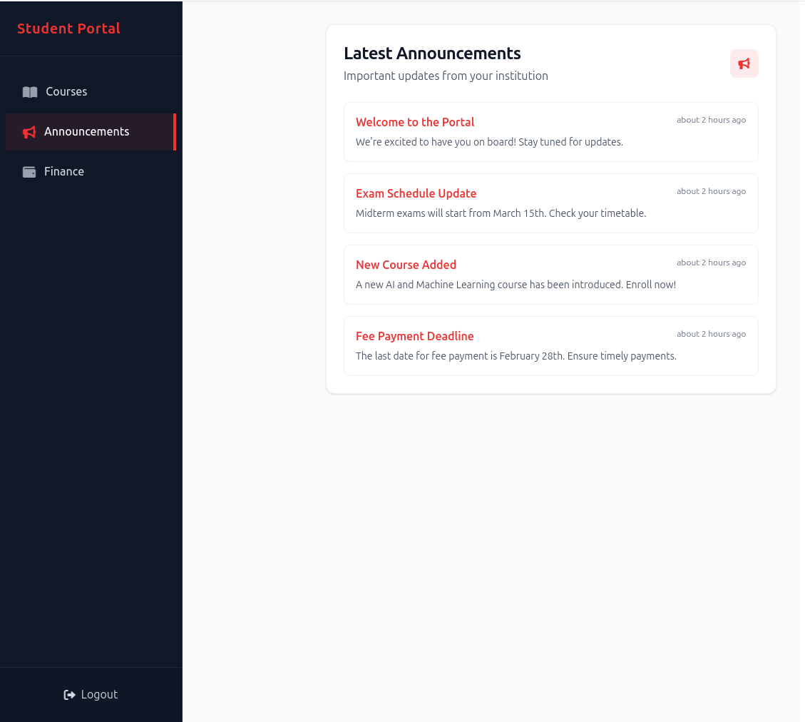

# Education Management System

### Web App Images



```
## Overview

This project is an education management system built with Ruby on Rails. It includes features like user roles (admin and student), course management, payment tracking, and real-time messaging.

## Features

- **User Roles**: Admin and student roles with respective dashboards.
- **Student Dashboard**: Displays courses, finance section showing payments and pending payments.
- **Admin Dashboard**: Manage users, courses, and payments.
- **Payment Integration**: Work in progress.
- **Real-Time Messaging**: Work in progress.

## Getting Started

To get a local copy up and running, follow these steps.

### Prerequisites

- Ruby
- Rails
- PostgreSQL

### Installation

1. Clone the repo

   ```sh
   git clone git@github.com:fabortwell/education_management_system.git
   ```

2. Install gems

   ```sh
   bundle install
   ```

3. Set up the database

   ```sh
   rails db:create
   rails db:migrate
   ```

4. Start the server

   ```sh
   rails server
   ```

## Usage

- Admin can manage users, courses, and payments.
- Students can view their courses, make payments, and receive real-time messages.

## Contributing

Contributions are what make the open-source community such an amazing place to be learn, inspire, and create. Any contributions you make are **greatly appreciated**.

1. Fork the Project
2. Create your Feature Branch (`git checkout -b feature/AmazingFeature`)
3. Commit your Changes (`git commit -m 'Add some AmazingFeature'`)
4. Push to the Branch (`git push origin feature/AmazingFeature`)
5. Open a Pull Request

## License

Distributed under the MIT License. See `LICENSE` for more information.

## Contact

Brian Sitati - [@itsme_brian](https://x.com/itsme_brian) - briansittt@gmail.com

Project Link: [https://github.com/fabortwell/education_management_system](https://github.com/fabortwell/education_management_system)
```
